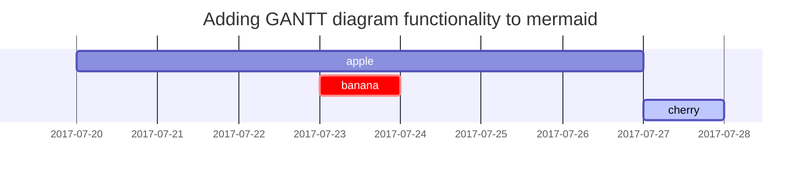

게시글 작성시 참고하기 위해 [Chipy : Text and Typography](https://chirpy.cotes.page/posts/text-and-typography/)를 가져왔습니다.

## Nameing & Path
`YYYY-MM-DD-TITLE.EXTENSION`의 형식으로 파일을 만들어서 `_posts` 폴더에 넣어주어야 한다.

`EXTENSION`은 `md` 혹은 `markdown`으로 해주어야 한다.

## Front Matter
글을 작성할 때 맨 앞에 아래와 같은 양식의 Front Matter를 작성해야 한다.


```markdown
---
title: Text and Typography
description: Examples of text, typography, math equations, diagrams, flowcharts, pictures, videos, and more.
author: cotes
date: 2019-08-08 11:33:00 +0800
categories: [Blogging, Demo]
tags: [typography]
pin: true
math: true
mermaid: true
comments: false
image:
  path: /commons/devices-mockup.png
  lqip: data:image/webp;base64,UklGRpoAAABXRUJQVlA4WAoAAAAQAAAADwAABwAAQUxQSDIAAAARL0AmbZurmr57yyIiqE8oiG0bejIYEQTgqiDA9vqnsUSI6H+oAERp2HZ65qP/VIAWAFZQOCBCAAAA8AEAnQEqEAAIAAVAfCWkAALp8sF8rgRgAP7o9FDvMCkMde9PK7euH5M1m6VWoDXf2FkP3BqV0ZYbO6NA/VFIAAAA
  alt: Responsive rendering of Chirpy theme on multiple devices.
---
```
- title : 게시글 제목
- description : 게시글 제목 밑에 보이는 설명
- author : 게시글 작성자(입력하지 않을 경우 global author가 default가 된다)
- data : 작성 시간
- categories : 첫 번째는 메인 카테고리, 두번째는 서브 카테고리이다. 
- pin : 홈페이지 메인 화면에 게시글이 고정된다. 순서는 포스팅 날짜가 최근일수록 위로 올라가게 된다.
- math : 수학 기호 사용 여부
- mermaid : 표 생성 도구 사용 여부
- comments : 댓글 생성 여부(default는 `config.yml`파일의 `comments`값에 의해 결정)
- published : 페이지 배포 여부

## 제목(Headings)

<!-- markdownlint-capture -->
<!-- markdownlint-disable -->

# H1 - heading
{: data-toc-skip='' .mt-4 .mb-0 }

## H2 — heading
{: data-toc-skip='' .mt-4 .mb-0 }

### H3 — heading
{: data-toc-skip='' .mt-4 .mb-0 }

#### H4 — heading
{: data-toc-skip='' .mt-4 }

<!-- markdownlint-restore -->

`data-toc-skip=''` 을 사용할 경우 해당 헤더가 toc 메뉴에 등장하지 않는다.

`mt-4` 상단 여백, `mb-0` 하단 여백


특정 스타일링이나 포맷팅 규칙이 MarkdownLint의 기본 규칙과 충돌하거나, Chirpy 테마에서 사용하는 맞춤 클래스를 적용할 때 MarkdownLint가 이를 오류로 간주할 수 있기 때문에 아래와 같은 비활성화 태그를 사용해주어야 한다.

```
<!-- markdownlint-capture -->  
<!-- markdownlint-disable -->  
<내용>  
<!-- markdownlint-restore -->
```

## Emphasis
- *이탤릭 1* _이탤릭 2_
- **굵게 2** , __굵게 2__
- ~~취소선~~
- <u>밑줄</u>

## Lists

### Ordered list
1. Firstly
2. Secondly
3. Thirdly

### Unordered list

- Chapter
  - Section
    - paragraph

### Todo list
- [x] Job
  - [ ] Step 1
  - [ ] Step 2
  - [ ] Step 3

### Description list

Sun
: the star around which the earth orbits

Moon
: the natural satellite of the earth, visible by reflected light from the sun

## Block Quote
> This Line shows the _block quote_.

## Prompts

<!-- markdownlint-capture -->
<!-- markdownlint-disable -->
> An example showing the `tip` type prompt.
{: .prompt-tip }

> An example showing the `info` type prompt.
{: .prompt-info }

> An example showing the `warning` type prompt.
{: .prompt-warning }

> An example showing the `danger` type prompt.
{: .prompt-danger }
<!-- markdownlint-restore -->

## Tables

| Company                      | Contact          | Country |
| :--------------------------- | :--------------- | ------: |
| Alfreds Futterkiste          | Maria Anders     | Germany |
| Island Trading               | Helen Bennett    |      UK |
| Magazzini Alimentari Riuniti | Giovanni Rovelli |   Italy |

## Links

- <http://127.0.0.1:4000>
- [로컬 호스트](http://127.0.0.1:4000)
- [로컬 호스트](http://127.0.0.1:4000 "마우스 호버링시 설명")
- [참조 링크][로컬 호스트] : 
글 내용안에서도 [참조 링크][로컬 호스트] 사용이 가능합니다.
[참조 링크2][로컬 호스트2]에 설명을 추가할수 있습니다.

[로컬 호스트]: http://127.0.0.1:4000
[로컬 호스트2]: http://127.0.0.1:4000 "마우스 호버링시 설명"

## Footnote

Click the hook will locate the footnote[^footnote], and here is another footnote[^fn-nth-2].

## Inline code

This is an example of `Inline Code`.

## Filepath

Here is the `/path/to/the/file.extend`{: .filepath}.

## Code blocks

### Common

```text
This is a common code snippet, without syntax highlight and line number.
```

### Specific Language

```bash
if [ $? -ne 0 ]; then
  echo "The command was not successful.";
  #do the needful / exit
fi;
```

### Specific filename

```sass
@import
  "colors/light-typography",
  "colors/dark-typography";
```
{: file='_sass/jekyll-theme-chirpy.scss'}

## Mathematics

The mathematics powered by [**MathJax**](https://www.mathjax.org/):

$$
\begin{equation}
  \sum_{n=1}^\infty 1/n^2 = \frac{\pi^2}{6}
  \label{eq:series}
\end{equation}
$$

We can reference the equation as \eqref{eq:series}.

When $a \ne 0$, there are two solutions to $ax^2 + bx + c = 0$ and they are

$$ x = {-b \pm \sqrt{b^2-4ac} \over 2a} $$

## Mermaid SVG



## Images

### Default (with caption)

{: width="972" height="589" }
_Full screen width and center alignment_

### Left aligned

{: width="972" height="589" .w-75 .normal}

### Float to left

{: width="972" height="589" .w-50 .left}
Praesent maximus aliquam sapien. Sed vel neque in dolor pulvinar auctor. Maecenas pharetra, sem sit amet interdum posuere, tellus lacus eleifend magna, ac lobortis felis ipsum id sapien. Proin ornare rutrum metus, ac convallis diam volutpat sit amet. Phasellus volutpat, elit sit amet tincidunt mollis, felis mi scelerisque mauris, ut facilisis leo magna accumsan sapien. In rutrum vehicula nisl eget tempor. Nullam maximus ullamcorper libero non maximus. Integer ultricies velit id convallis varius. Praesent eu nisl eu urna finibus ultrices id nec ex. Mauris ac mattis quam. Fusce aliquam est nec sapien bibendum, vitae malesuada ligula condimentum.

### Float to right

{: width="972" height="589" .w-50 .right}
Praesent maximus aliquam sapien. Sed vel neque in dolor pulvinar auctor. Maecenas pharetra, sem sit amet interdum posuere, tellus lacus eleifend magna, ac lobortis felis ipsum id sapien. Proin ornare rutrum metus, ac convallis diam volutpat sit amet. Phasellus volutpat, elit sit amet tincidunt mollis, felis mi scelerisque mauris, ut facilisis leo magna accumsan sapien. In rutrum vehicula nisl eget tempor. Nullam maximus ullamcorper libero non maximus. Integer ultricies velit id convallis varius. Praesent eu nisl eu urna finibus ultrices id nec ex. Mauris ac mattis quam. Fusce aliquam est nec sapien bibendum, vitae malesuada ligula condimentum.

## Reverse Footnote

[^footnote]: The footnote source
[^fn-nth-2]: The 2nd footnote source